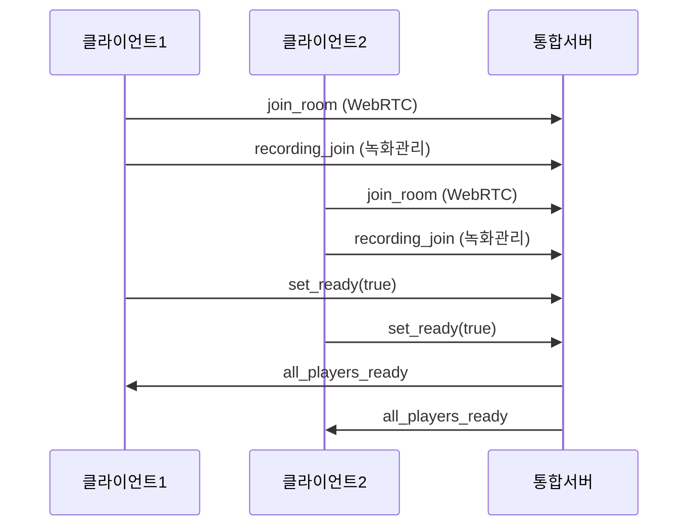
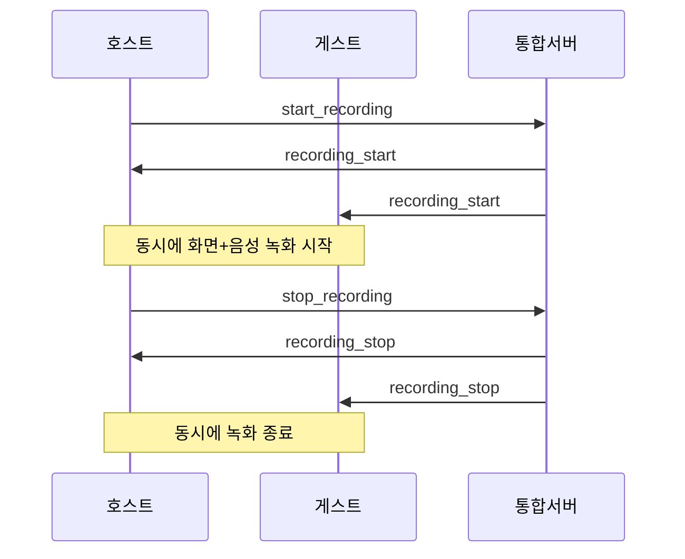
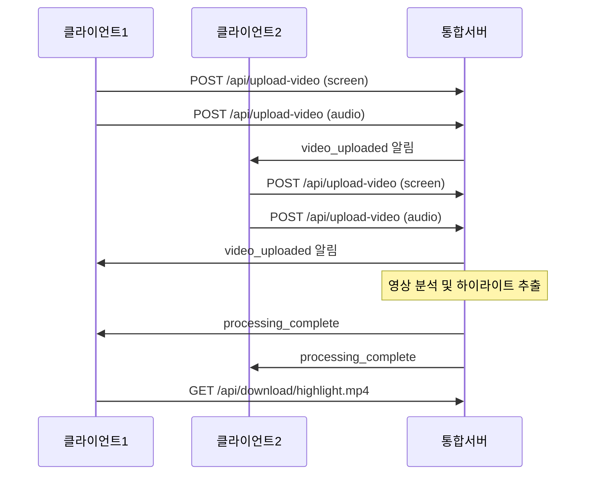

# 🎮 게임캐스트 통합 서버

Socket.IO 기반 **실시간 음성채팅** + **녹화 관리** + **파일 처리**를 모든 포함한 통합 서버입니다.

## 🏗️ **서버 구조**

```
🎮 통합 서버 (포트 3000)
├── 📡 Socket.IO 실시간 통신
│   ├── WebRTC 시그널링
│   ├── 녹화 상태 관리
│   └── 실시간 알림
├── 🌐 REST API
│   ├── 파일 업로드
│   ├── 파일 다운로드
│   └── 방 상태 조회
└── 💾 파일 저장소
    ├── storage/raw-videos/    (업로드된 원본)
    ├── storage/processed/     (처리된 영상)
    └── storage/subtitles/     (생성된 자막)
```

## 🚀 **서버 실행**

### **1. 의존성 설치**
```bash
cd backend-realtime
npm install
```

### **2. 서버 시작**
```bash
# 통합 서버 실행
node unified-server.js

# 또는 개발용 (nodemon)
npm run dev unified-server.js
```

### **3. 서버 확인**
```
🎮 통합 게임캐스트 서버가 포트 3000에서 실행 중입니다
📡 Socket.IO: http://localhost:3000
🌐 REST API: http://localhost:3000/api
📁 파일 업로드: POST /api/upload-video
📥 파일 다운로드: GET /api/download/:filename
```

## 📡 **Socket.IO 이벤트**

### **클라이언트 → 서버**

#### **1. WebRTC 시그널링**
```typescript
socket.emit('join_room', { room: 'room123' });
socket.emit('webrtc_offer', { offer, target_sid: 'user456' });
socket.emit('webrtc_answer', { answer, target_sid: 'user789' });
socket.emit('webrtc_ice_candidate', { candidate, target_sid: 'user456' });
```

#### **2. 녹화 관리**
```typescript
socket.emit('recording_join', {
  roomId: 'room123',
  playerId: 'player456',
  playerName: '플레이어이름'
});

socket.emit('set_ready', {
  playerId: 'player456',
  playerName: '플레이어이름',
  isReady: true
});

socket.emit('start_recording');  // 호스트만
socket.emit('stop_recording');   // 호스트만
```

### **서버 → 클라이언트**

#### **1. WebRTC 시그널링**
```typescript
socket.on('user_joined', ({ sid }) => { /* 새 사용자 입장 */ });
socket.on('user_left', ({ sid }) => { /* 사용자 퇴장 */ });
socket.on('webrtc_offer', ({ offer, sid }) => { /* Offer 수신 */ });
socket.on('webrtc_answer', ({ answer, sid }) => { /* Answer 수신 */ });
socket.on('webrtc_ice_candidate', ({ candidate, sid }) => { /* ICE 후보 수신 */ });
```

#### **2. 녹화 관리**
```typescript
socket.on('ready_status_update', ({ playersReady }) => {
  // 플레이어 준비 상태 업데이트
});

socket.on('all_players_ready', () => {
  // 모든 플레이어 준비 완료
});

socket.on('recording_start', () => {
  // 녹화 시작 - 모든 클라이언트에게 동시 전송
});

socket.on('recording_stop', () => {
  // 녹화 종료 - 모든 클라이언트에게 동시 전송
});

socket.on('video_uploaded', ({ playerName, recordingType, filename }) => {
  // 다른 플레이어의 영상 업로드 완료 알림
});

socket.on('processing_complete', ({ highlightVideo, message }) => {
  // 영상 처리 완료 알림
});
```

## 🌐 **REST API**

### **1. 영상 업로드**
```bash
POST /api/upload-video
Content-Type: multipart/form-data

Form Data:
- video: [파일]
- roomId: "room123"
- playerId: "player456"
- playerName: "플레이어이름"
- recordingType: "screen" | "audio"
```

**응답:**
```json
{
  "success": true,
  "fileId": "1638360000000-123456789.webm",
  "message": "업로드 완료"
}
```

### **2. 파일 다운로드**
```bash
GET /api/download/highlight_1638360000000.mp4
```

### **3. 방 상태 조회**
```bash
GET /api/room/room123/status
```

**응답:**
```json
{
  "roomId": "room123",
  "recordingState": "recording",
  "hostId": "player456",
  "players": [
    {
      "id": "player456",
      "name": "플레이어1",
      "isReady": true
    }
  ],
  "recordings": {
    "player456": {
      "screen": {
        "filename": "player1_screen_1638360000000.webm",
        "size": 15728640,
        "uploadTime": "2024-01-01T12:00:00.000Z"
      },
      "audio": {
        "filename": "player1_audio_1638360000000.webm",
        "size": 2097152,
        "uploadTime": "2024-01-01T12:00:00.000Z"
      }
    }
  }
}
```

### **4. 영상 처리 요청**
```bash
POST /api/process-video
Content-Type: application/json

{
  "roomId": "room123",
  "fileIds": ["file1.webm", "file2.webm"]
}
```

## 🎯 **전체 워크플로우**

### **1. 방 입장 및 준비**


### **2. 녹화 시작 및 진행**


### **3. 파일 업로드 및 처리**


## 💰 **비용 절약 포인트**

### **✅ 클라이언트에서 처리**
- **자막 생성**: Web Speech API 사용 (무료)
- **영상 녹화**: MediaRecorder API 사용 (무료)
- **파일 저장**: 클라이언트 로컬 저장 후 업로드

### **🔧 서버에서 처리**
- **영상 분석**: CPU 기반 처리 (GPU보다 저렴)
- **하이라이트 추출**: FFmpeg 등 오픈소스 도구
- **파일 관리**: 로컬 스토리지 사용

## 🛠️ **개발 팁**

### **클라이언트 연동**
```typescript
// useRecording 훅에서 Socket.IO 사용
import { io } from 'socket.io-client';

const socket = io('http://localhost:3000');
socket.emit('recording_join', { roomId, playerId, playerName });
```

### **파일 업로드**
```typescript
const uploadVideo = async (videoBlob: Blob, recordingType: 'screen' | 'audio') => {
  const formData = new FormData();
  formData.append('video', videoBlob);
  formData.append('roomId', currentRoom.id);
  formData.append('recordingType', recordingType);
  
  const response = await fetch('http://localhost:3000/api/upload-video', {
    method: 'POST',
    body: formData
  });
};
```

### **실시간 자막 (클라이언트)**
```typescript
// Web Speech API 사용 - 완전 무료!
const recognition = new webkitSpeechRecognition();
recognition.continuous = true;
recognition.lang = 'ko-KR';
recognition.onresult = (event) => {
  // 실시간 자막 생성
};
```

## 🎉 **완성된 기능들**

- ✅ **실시간 음성채팅** (WebRTC P2P)
- ✅ **동기화된 녹화 시작/종료**
- ✅ **파일 업로드/다운로드**
- ✅ **실시간 상태 공유**
- ✅ **방 관리 및 호스트 권한**
- ✅ **비용 효율적인 자막 생성** (클라이언트)

이제 하나의 서버에서 모든 게임캐스트 기능을 처리할 수 있습니다! 🚀 