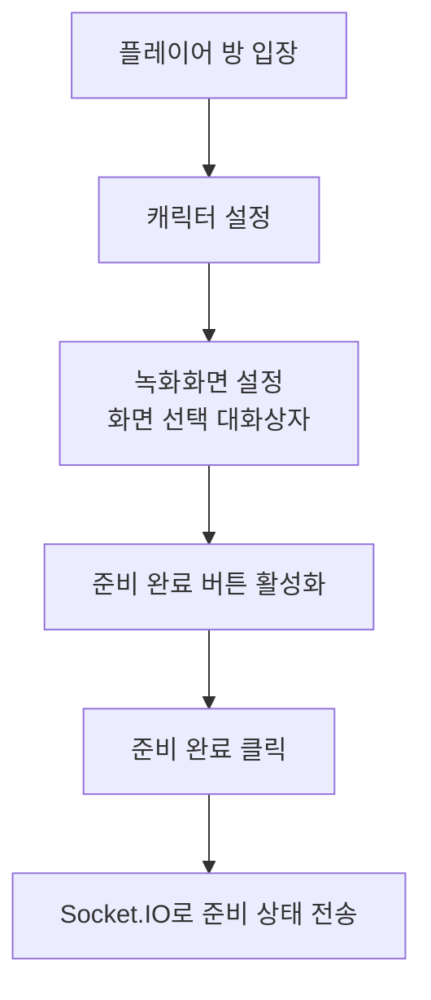
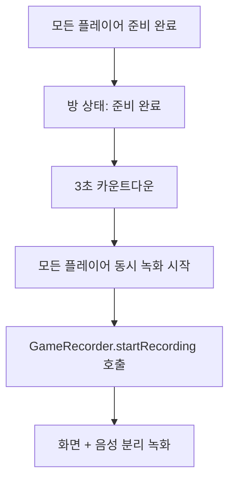
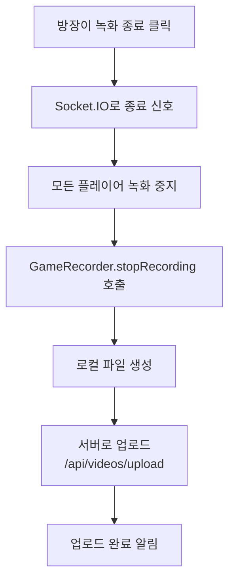

# GameRecorder 통합 가이드

## 📋 개요

GameRecorder는 게임 스트리밍 서비스를 위한 고성능 녹화 시스템입니다. 화면 녹화와 마이크 음성을 분리해서 처리하며, Socket.IO를 통한 실시간 상태 동기화를 지원합니다.

## 🎯 주요 기능

### 1. 화면 녹화 (Screen Recording)
- **해상도**: 1920x1080
- **프레임레이트**: 60fps
- **포맷**: WebM (VP9 코덱)
- **비트레이트**: 8Mbps 고화질
- **화면 선택**: 애플리케이션 창만 선택 가능

### 2. 음성 녹음 (Audio Recording)
- **포맷**: WebM (Opus 코덱)
- **비트레이트**: 128kbps 고음질
- **오디오 처리**: echoCancellation, noiseSuppression, autoGainControl
- **분리 처리**: 화면 녹화와 완전히 독립적

### 3. 실시간 동기화
- **Socket.IO 연동**: 방 전체 녹화 상태 동기화
- **자동 시작**: 모든 플레이어 준비 시 3초 카운트다운 후 동시 시작
- **방장 제어**: 방장만 녹화 종료 가능

## 🔧 사용 방법

### 1. GameRecorder 클래스 직접 사용

```typescript
import { GameRecorder } from '../utils/GameRecorder';

const recorder = new GameRecorder();

// 1단계: 화면 선택
const screenResult = await recorder.selectScreen();
if (screenResult.success) {
  console.log('화면 선택 완료');
} else {
  console.error('화면 선택 실패:', screenResult.error);
}

// 2단계: 녹화 시작
await recorder.startRecording('ROOM123', 'user456', 'League of Legends');

// 3단계: 녹화 종료 및 업로드
const uploadResult = await recorder.stopRecording('ROOM123', 'user456', 'League of Legends');
console.log('업로드 완료:', uploadResult);
```

### 2. useGameRecording 훅 사용 (권장)

```typescript
import { useGameRecording } from '../hooks/useGameRecording';

function GameRoom() {
  const {
    recordingStatus,
    playersReadyStatus,
    allPlayersReady,
    isHost,
    formatTime,
    setPlayerReady,
    stopRecording,
    getGameRecorder
  } = useGameRecording(currentRoom, currentPlayer);

  // 화면 선택
  const handleScreenSetup = async () => {
    const gameRecorder = getGameRecorder();
    const result = await gameRecorder.selectScreen();
    if (result.success) {
      // 화면 설정 완료 처리
    }
  };

  // 준비 완료
  const handleReady = () => {
    setPlayerReady(true);
  };

  // 녹화 종료 (방장 전용)
  const handleStopRecording = () => {
    if (isHost) {
      stopRecording();
    }
  };

  return (
    <div>
      <button onClick={handleScreenSetup}>녹화화면 설정</button>
      <button onClick={handleReady}>준비 완료</button>
      {isHost && recordingStatus.state === 'recording' && (
        <button onClick={handleStopRecording}>
          녹화 종료 ({formatTime(recordingStatus.duration)})
        </button>
      )}
    </div>
  );
}
```

## 🔄 서비스 플로우

### 1. 준비 단계


### 2. 녹화 시작


### 3. 녹화 종료


## 📡 Socket.IO 이벤트

### Client → Server
```typescript
// 준비 상태 업데이트
socket.emit('update-preparation-status', {
  roomCode: 'ROOM123',
  playerId: 'user456',
  playerName: '플레이어',
  characterSetup: true,
  screenSetup: true,
  isReady: true
});

// 녹화 종료 (방장 전용)
socket.emit('stop-recording', {
  roomCode: 'ROOM123',
  hostId: 'host123'
});

// 녹화 에러 보고
socket.emit('recording-error', {
  roomCode: 'ROOM123',
  playerId: 'user456',
  error: '마이크 권한 거부됨'
});
```

### Server → Client
```typescript
// 플레이어 준비 상태
socket.on('players-ready-status', (players) => {
  // players: [{ playerId, isReady, playerName }]
});

// 모든 플레이어 준비 완료
socket.on('all-players-ready', () => {
  // 3초 카운트다운 시작
});

// 녹화 시작 카운트다운
socket.on('recording-start-countdown', (data) => {
  // data: { countdown: 3 }
});

// 녹화 시작
socket.on('recording-started', () => {
  // GameRecorder.startRecording() 호출
});

// 녹화 종료
socket.on('recording-stopped', () => {
  // GameRecorder.stopRecording() 호출
});
```

## 🗂️ 서버 업로드 사양

### API 엔드포인트
- **URL**: `/api/videos/upload`
- **Method**: `POST`
- **Content-Type**: `multipart/form-data`

### FormData 필드
```typescript
interface UploadData {
  video: Blob;        // 화면 녹화 파일 (WebM)
  audio: Blob;        // 음성 녹음 파일 (WebM)
  roomCode: string;   // 방 코드
  userId: string;     // 사용자 ID
  gameTitle: string;  // 게임 제목
  duration: number;   // 녹화 시간 (초)
  resolution: string; // 해상도 (예: "1920x1080")
  fps: number;        // 프레임레이트 (예: 60)
  description: string; // 설명
}
```

### 서버 응답
```json
{
  "resultType": "success",
  "error": "string",
  "success": true,
  "data": {
    "message": "게임 녹화 영상이 성공적으로 등록되었습니다",
    "videoId": "43f461747e0ae",
    "filePath": "string",
    "metadata": {
      "roomCode": "ARG012",
      "userId": "user123",
      "gameTitle": "League of Legends",
      "duration": 1524,
      "resolution": "1920x1080",
      "fps": 60
    }
  },
  "timestamp": "2024-08-04T18:27:59.9902",
  "status": "processing",
  "description": "Epic gaming moment"
}
```

## ⚠️ 에러 처리

### 화면 선택 에러
```typescript
// 권한 거부
if (error.name === 'NotAllowedError') {
  return '화면 공유 권한이 거부되었습니다. 브라우저에서 화면 공유를 허용해주세요.';
}

// 화면 없음
if (error.name === 'NotFoundError') {
  return '공유 가능한 화면을 찾을 수 없습니다.';
}

// 브라우저 미지원
if (error.name === 'NotSupportedError') {
  return '이 브라우저는 화면 공유를 지원하지 않습니다.';
}
```

### 마이크 접근 에러
```typescript
// 마이크 권한 거부
if (error.name === 'NotAllowedError') {
  return '마이크 권한이 거부되었습니다. 브라우저 설정에서 마이크 권한을 허용해주세요.';
}

// 마이크 장치 없음
if (error.name === 'NotFoundError') {
  return '마이크 장치를 찾을 수 없습니다.';
}

// 마이크 사용 중
if (error.name === 'NotReadableError') {
  return '다른 애플리케이션에서 마이크를 사용 중입니다. 다른 프로그램을 종료하고 다시 시도해주세요.';
}
```

### 네트워크 에러
```typescript
// 업로드 실패
try {
  const response = await fetch('/api/videos/upload', {
    method: 'POST',
    body: formData
  });
  
  if (!response.ok) {
    throw new Error(`서버 응답 오류: ${response.status} ${response.statusText}`);
  }
} catch (error) {
  if (error.message.includes('fetch')) {
    throw new Error('네트워크 연결을 확인해주세요.');
  }
  throw error;
}
```

## 🔍 디버깅

### 로그 메시지
```typescript
// GameRecorder 로그
🎮 [GameRecorder] Starting screen selection...
✅ [GameRecorder] Screen selected successfully
🎬 [GameRecorder] Starting recording...
📹 [GameRecorder] Screen recording started
🎤 [GameRecorder] Audio recording started
📦 [GameRecorder] Files prepared for upload
📤 [GameRecorder] Starting upload to server...
✅ [GameRecorder] Upload completed successfully

// useGameRecording 로그
🔌 [useGameRecording] Initializing Socket.IO connection
👥 [useGameRecording] Players ready status
✅ [useGameRecording] All players ready
⏰ [useGameRecording] Recording starts in 3 seconds...
🎬 [useGameRecording] Recording started by server!
⏹️ [useGameRecording] Recording stopped by server!
```

### 상태 확인
```typescript
// 녹화 상태 확인
const recordingState = gameRecorder.getRecordingState();
console.log('Recording state:', recordingState);

// 화면 선택 여부 확인
const isScreenSelected = gameRecorder.isScreenSelected();
console.log('Screen selected:', isScreenSelected);

// 비디오 메타데이터 확인
const metadata = gameRecorder.getVideoMetadata();
console.log('Video metadata:', metadata);
```

## 🚀 최적화 팁

1. **파일 크기 최적화**: 비트레이트를 게임 종류에 따라 조정
2. **네트워크 최적화**: 업로드 중 진행률 표시
3. **메모리 관리**: 녹화 종료 시 즉시 리소스 정리
4. **에러 복구**: 네트워크 실패 시 재업로드 기능
5. **사용자 경험**: 카운트다운 UI, 녹화 시간 표시

이 시스템을 통해 안정적이고 고품질의 게임 녹화 서비스를 제공할 수 있습니다.